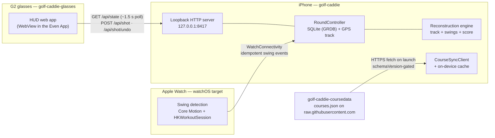

# GolfCaddie

A three-device golf shot tracker: an iOS + watchOS app (Swift/SwiftUI, ~17k LOC)
that records every round passively, a companion HUD for Even Realities G2 smart
glasses, and a serverless course-data pipeline. Built to replace a commercial
shot-tracking app for personal use — and to be architecturally honest about
what each device is good at.

The core idea: **marking a shot becomes confirming, not capturing.** The phone
records a continuous GPS track; the watch detects swings from wrist motion; the
entered score is the final backstop. At hole-out, a reconstruction engine
settles the hole from all three signals — so forgetting to tap never costs the
data. Reconstruction has been validated against real on-course rounds and is
backed by a ~140-test unit suite.

## Demo

<!-- TODO: demo GIF — active round on iPhone (satellite map + Mark Shot), watch swing detection, G2 HUD -->
<!-- TODO: screenshots — hole review / reconstruction card, scorecard, glasses simulator frames -->

## System architecture

Three repos, decoupled by explicit contracts:

| Repo | Role | Stack |
|---|---|---|
| **golf-caddie** (this repo) | iPhone app (source of truth: GPS track, rounds, scorecard, reconstruction) + watchOS target (swing detection) | Swift, SwiftUI, GRDB/SQLite, CoreLocation, MapKit, WatchConnectivity, XcodeGen |
| [golf-caddie-glasses](https://github.com/moisesvargasjr/golf-caddie-glasses) | Even Realities G2 HUD — a web app running in the Even App's WebView, rendering live round state on the 576×288 glasses display | TypeScript, Vite, Even Hub SDK, simulator-driven dev with a mock API server |
| [golf-caddie-coursedata](https://github.com/moisesvargasjr/golf-caddie-coursedata) | Curated per-course reference data (par, yardage, stroke index, tee/green anchors) with a schema-validating CLI | TypeScript CLI, JSON published straight from the repo — no backend |

Each device has one job, and every configuration degrades gracefully — four
setups are first-class: phone-only, phone+watch, phone+glasses, all three.

- **iPhone — source of truth.** Continuous background GPS during a round
  (cheap baseline accuracy, ramped to best on demand), the round/map/scorecard
  UI, and the hole-out reconstruction engine.
- **Apple Watch — primary input.** On-wrist swing detection from fused
  Core Motion data, kept alive wrist-down by an `HKWorkoutSession`. Detections
  feed reconstruction rather than being the final word; manual tap is a
  backstop. Command delivery over WatchConnectivity is idempotent.
- **G2 glasses — primary glance.** A read-only HUD on the live path (yardage,
  hole state, score); a gesture-input lane exists but is gated off as a
  fallback.



## The phone ⇄ glasses JSON contract

The glasses app never talks to a cloud. The iOS app embeds a small HTTP server
bound to **loopback (`127.0.0.1:8417`)** — the Even App's WebView runs on the
same phone, and round data never touches the Wi-Fi network. The server stays
responsive while backgrounded by riding the round's existing location
background mode; no extra entitlements.

Four endpoints, one versioned read model (`GolfState`, `contractVersion`):

- `GET /api/state` — the full round read model (hole, yardage to green,
  scoring, GPS quality, battery, per-hole scorecard). Polled ~every 1.5 s.
- `POST /api/shot` / `POST /api/shot/undo` — the gated input lane. Fast
  (<500 ms p99), read-after-write (the response already reflects the write),
  never auto-retried, single-writer.
- `GET /api/health` — distinguishes "server up, no round" from "server down."

The contract is maintained in lockstep on both sides: a canonical markdown
spec plus TypeScript types in the glasses repo, mirrored by Swift `Codable`
models here (`GolfCaddie/Glasses/`). Encoding rules are explicit down to
"no JSON `null`, ever" and ISO-8601 formatting — see
[`docs/GLASSES_INTEGRATION.md`](docs/GLASSES_INTEGRATION.md).

## Course data without a backend

Course reference data ships as a single `courses.json` published from the
[golf-caddie-coursedata](https://github.com/moisesvargasjr/golf-caddie-coursedata)
repo. The app fetches it from the repo's **raw GitHub URL** when online, caches
it on-device, and reads only the cache on the course. There is nothing to
operate and nothing that can be down at a signal-dead course; uncurated courses
fall back to fully manual entry.

Publishing is `validate → commit → push`. A `schemaVersion` field plus a
validator CLI form the lockstep contract with the app's decoder
(`GolfCaddie/Models/CuratedCourse.swift`) — the app rejects payloads it does
not understand and keeps its last good cache. The pipeline also handles
multi-nine facilities: 9-hole courses are the source of truth, and 18-hole
rotation "combos" are materialized from them by the CLI.

## Engineering notes

- **Hole-out reconstruction** (`GolfCaddie/Capture/`): segments the GPS track
  per hole, detects stops/dwells, reconciles watch swing timestamps against
  track geometry, dedupes a manual mark against a watch auto-detect of the
  same swing, and uses the entered score as ground truth. Two paths — with and
  without the watch — both validated on real rounds.
- **Dual-mode GPS**: cheap continuous trace (~10 m distance filter) with an
  on-demand ramp to best accuracy at mark time, designed to keep battery
  drain acceptable over a full round.
- **Deliberate coupling boundaries**: the glasses server drives the same
  `@MainActor RoundController` the UI owns (so writes are visible everywhere),
  but the whole glasses subsystem is documented as removable in one pass.
- **Everything works phone-only.** The watch and glasses add convenience, not
  correctness.

## Build & develop

The Xcode project is generated — `project.yml` (XcodeGen) is the source of
truth. Targets: iOS 26 (iPhone) and watchOS 11.

```sh
brew bundle            # gh, xcodegen, swiftformat, swiftlint, xcbeautify, xcodes
xcodegen generate
open GolfCaddie.xcodeproj
```

GPS, the Action button, and swing detection need real hardware, so development
deploys to a physical iPhone and Apple Watch. Distribution is personal, via
TestFlight internal testing (`scripts/release-testflight.sh`).

The unit test suite (`GolfCaddieTests/`, ~140 tests) covers reconstruction,
segmentation, swing detection, migrations, the glasses state mapper, and
watch command idempotency.

An iPhone Action button Shortcut can trigger `golfcaddie://mark` for a
physical, no-unlock shot mark; see `docs/ACTION_BUTTON.md`.

## Documentation

- [`DESIGN.md`](DESIGN.md) — original design: data model, UI layout, location
  strategy (the phase plan at the bottom is historical)
- [`docs/RECONCILED_BACKLOG.md`](docs/RECONCILED_BACKLOG.md) — the single
  source of truth for current direction and the live backlog
- [`docs/GLASSES_INTEGRATION.md`](docs/GLASSES_INTEGRATION.md) — the iOS-side
  copy of the phone ⇄ glasses contract
- [`docs/WATCH_FEASIBILITY.md`](docs/WATCH_FEASIBILITY.md) — watch swing
  detection feasibility work
- Sibling repos carry their own docs: the glasses repo's `docs/` holds the
  canonical integration contract, architecture, and deployment guide; the
  coursedata repo documents the schema and curation CLI.

## Status

Actively developed personal project. The reconstruction spine (phone-only and
watch-assisted paths) is merged and field-validated; the glasses HUD and the
course-data sync loop ship today. The live backlog, including open product
decisions, lives in [`docs/RECONCILED_BACKLOG.md`](docs/RECONCILED_BACKLOG.md).
